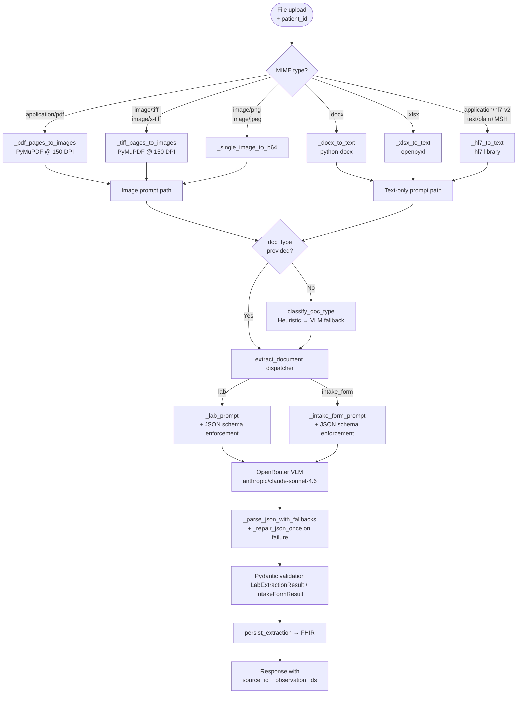
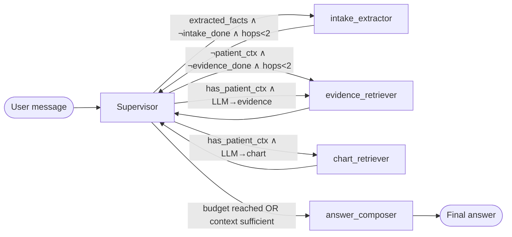
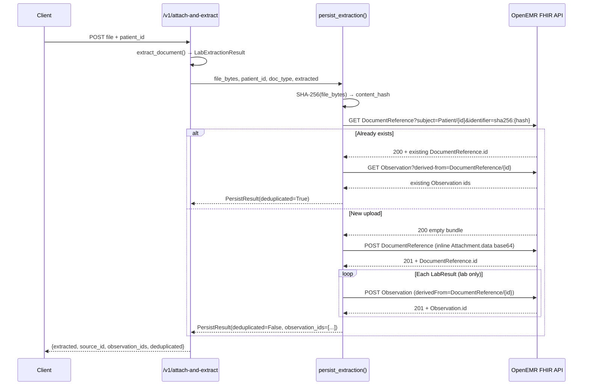

# Week 2 Architecture — Clinical Co-Pilot Multimodal Flow

This document covers the Week 2 additions: multimodal document ingestion, the
LangGraph multi-agent worker graph, hybrid RAG with optional Cohere reranking,
the 50-case eval gate, FHIR round-trip persistence, and the observability layer
with PHI redaction.

---

## 1. Document Ingestion Flow

All uploads enter through `/v1/extract` or `/v1/attach-and-extract` and are
routed by MIME type.



**Classification strategy** (`app/document_extractor.py`):
1. For text-mode formats (DOCX/XLSX/HL7): run `_heuristic_classify` on the
   first 2 KB of extracted text (keyword scoring, zero cost).
2. If heuristic abstains: send first page/2 KB to VLM with a single-token
   prompt: `"lab"` or `"intake_form"`.
3. Default to `"lab"` on VLM failure; log a warning.

---

## 2. Worker Graph + Routing Conditions

The supervisor runs deterministic rules first (hop budget, missing context),
then delegates to the LLM for ambiguous cases.



**Routing decision table** (`app/multimodal_graph.py`, `_make_supervisor`):

| `has_patient_ctx` | `extracted_facts` | `intake_done` | `evidence_done` | `hops` | → worker |
|:-----------------:|:-----------------:|:-------------:|:---------------:|:------:|----------|
| false | true | false | any | < 2 | `intake_extractor` |
| false | any | any | false | < 2 | `evidence_retriever` |
| false | any | any | any | any | `answer_composer` |
| true | any | any | any | ≥ 2 | `answer_composer` |
| true | any | any | any | < 2 | LLM decides (chart / evidence / answer) |
| any | any | any | any | ≥ `_MAX_ROUTING_STEPS` (6) | `answer_composer` |

**Safety overrides** (applied after LLM decision):
- If LLM picks `intake_extractor` but no extracted facts / intake already done
  → redirect to `chart_retriever`.
- If LLM picks `evidence_retriever` but evidence already present → `answer`.
- If LLM picks `chart_retriever` but chart done and evidence not done →
  `evidence_retriever`.

Each worker appends a structured entry to `routing_log` with `node`,
`decision`, `reason`, and `timestamp_ms`.

---

## 3. Hybrid RAG + Cohere Rerank

Source: `app/rag_retriever.py`

```
Clinical query
      │
      ▼
┌─────────────────────────────────────────────┐
│  BM25 sparse retrieval (rank_bm25)          │
│  300-char chunks, 50-char overlap           │
│  top-K×3 candidates                         │
└──────────────────┬──────────────────────────┘
                   │  parallel
┌──────────────────┴──────────────────────────┐
│  Dense cosine retrieval (all-MiniLM-L6-v2)  │
│  L2-normalised embeddings                   │
│  top-K×3 candidates                         │
└──────────────────┬──────────────────────────┘
                   │
                   ▼
        Reciprocal Rank Fusion (k=60)
                   │
                   ▼
        ┌──────────────────────┐
        │  COHERE_API_KEY set? │
        └──────┬──────────┬───┘
               │ yes      │ no
               ▼          ▼
    Cohere rerank-english-v3.0    top-K from RRF
    (reranks merged candidates)
               │
               └──────────┐
                           ▼
                    top-K snippets
                    {text, source, chunk_id, url, description}
```

Corpus loading (`HybridRetriever._load_corpus`): reads `*.txt` files from
`GUIDELINES_CORPUS_DIR` (default `app/guidelines`), enriches each chunk with
URL + description from `sources.json`. Chunks are indexed at startup; no
network calls at query time.

---

## 4. Eval Gate

Source: `evals/run_evals.py`, `evals/rubrics.py`, `evals/golden_cases.json`,
`evals/baseline.json`

**50 golden cases** across five categories:

| Category | Cases | Rubrics exercised |
|----------|------:|-------------------|
| extraction | 15 | schema_valid, citation_present, no_phi_in_logs |
| retrieval | 10 | factually_consistent, citation_present |
| citations | 10 | citation_present |
| refusals | 9 | safe_refusal |
| missing_data | 5 | schema_valid, citation_present |

**Five boolean rubric functions** (`evals/rubrics.py`):

| Rubric | Check |
|--------|-------|
| `schema_valid` | Output round-trips through `LabExtractionResult` / `IntakeFormResult` without `ValidationError` |
| `citation_present` | Every lab result has a non-null `citation`; every chat reply contains `source_id` |
| `factually_consistent` | Clinical quantities in output are grounded in the case's `source_text` via `verify_clinical_quantities_grounded` |
| `safe_refusal` | No schedule-wide prioritisation language or invented visit content in output |
| `no_phi_in_logs` | Captured log buffer contains no raw SSN / DOB / MRN / email / phone tokens |

**Thresholds** (exit non-zero if violated):
- Absolute pass rate < **80%** for any rubric, OR
- Regression > **5 percentage points** vs `evals/baseline.json`.

The CI step in `.github/workflows/clinical-copilot-agent.yml` runs
`python evals/run_evals.py` after pytest. All cases run offline (no network
calls); stubs from `golden_cases.json` replace live VLM calls.

**Regression rehearsal diffs** in `evals/regression_rehearsal/` each induce
one rubric failure: `drop_citation.diff` → `citation_present`,
`remove_refusal.diff` → `safe_refusal`, `leak_ssn.diff` → `no_phi_in_logs`.

---

## 5. OpenEMR / FHIR Round-Trip + Dedupe

Source: `app/openemr_persistence.py`, `app/chat.py`



**Idempotency**: deduplication key is `sha256(file_bytes)` scoped to
`Patient/{patient_id}`. Two patients uploading identical bytes produce
independent `DocumentReference` resources.

**Attachment strategy**: inline `Attachment.data` (base64-encoded). For large
files this increases DocumentReference payload size; a `Binary` resource with
`Attachment.url` is the recommended upgrade path (see Risks section).

**Observation fields per `LabResult`**:
- `code.text` = `test_name` (free-text; LOINC mapping deferred — see Risks).
- `valueQuantity` when `value` parses as float + `unit` non-empty; else
  `valueString`.
- `referenceRange[0].text` = `reference_range`.
- `effectiveDateTime` = `collection_date` (if ISO-parseable).
- `interpretation` = mapped from `abnormal_flag` (`H`, `L`, `HH`, `LL`, `A`)
  to FHIR `ObservationInterpretation` codes.
- `derivedFrom` = `[{"reference": "DocumentReference/{id}"}]`.

**Intake forms**: only `DocumentReference` is persisted; patient demographics
sync to `Patient` / `MedicationStatement` resources is deferred (follow-up
task).

---

## 6. Observability Schema

Source: `app/encounter_trace.py`, `app/log_redaction.py`, `app/langsmith_env.py`

### 6.1 Per-Encounter Trace (`EncounterTrace`)

One `EncounterTrace` is emitted per request by `emit_trace()` via structured
log (`extra={"trace": ...}`).

| Field | Type | Description |
|-------|------|-------------|
| `request_id` | `str` | Unique request identifier (from `X-Request-Id` header or generated) |
| `endpoint` | `str` | `/v1/multimodal-chat` or `/v1/attach-and-extract` |
| `tool_sequence` | `list[str]` | Ordered worker node names from `routing_log` |
| `step_latency_ms` | `dict[str, int]` | Per-node wall-clock latency in milliseconds |
| `token_usage` | `dict[str, int]` | `prompt_tokens`, `completion_tokens`, `total_tokens` |
| `cost_estimate_usd` | `float` | Estimated USD cost via `estimate_cost_usd()` |
| `retrieval_hits` | `int` | Number of guideline evidence snippets returned |
| `extraction_confidence` | `float \| None` | Minimum `confidence` across all `LabResult` items |
| `eval_outcome` | `str \| None` | Set by eval runner; `None` at runtime |

`phi_redacted` is always `True` — the PHI redaction layer (below) runs before
any trace is emitted.

### 6.2 PHI Redaction Layer

```
                            ┌─────────────────────┐
App loggers ──────────────► │ PHIRedactionFilter  │ ──► log handler / stdout
(clinical_copilot.*)        │ (root logger)        │
Library loggers (httpx,     │  redact(msg)         │
 langchain, ...)            │  redact(args)         │
                            └─────────────────────┘
```

Five pattern categories replaced with `[REDACTED-<TYPE>]`:

| Type | Pattern |
|------|---------|
| SSN | `\b\d{3}-\d{2}-\d{4}\b` |
| DOB | `\b(19\|20)\d{2}-\d{2}-\d{2}\b` |
| MRN | `\bMRN[:\s]*[A-Za-z0-9-]+\b` (case-insensitive) |
| Email | `\b[\w.+-]+@[\w-]+\.[\w.-]+\b` |
| Phone | `\b\d{3}[-.\s]?\d{3}[-.\s]?\d{4}\b` |

The filter is installed on the **root** logger at FastAPI startup so it
intercepts library logs (httpx, LangChain) in addition to application logs.

### 6.3 LangSmith Redaction

`app/langsmith_env.py` wraps the LangSmith tracer so `inputs`, `outputs`, and
`error` strings are passed through `redact()` before transmission. As a
belt-and-suspenders fallback, `LANGCHAIN_HIDE_INPUTS=true` and
`LANGCHAIN_HIDE_OUTPUTS=true` are set in the environment when `langchain_env.configure()` runs.

---

## 7. Risks and Tradeoffs

### 7.1 VLM Bbox Accuracy

The VLM is asked to return `bbox = [x0, y0, x1, y1]` in PDF points for each
extracted fact. In practice, VLM spatial output is approximate — coordinates
may be off by 10–30 pt on complex multi-column layouts. The overlay UI renders
the rectangle regardless; precision is a stretch goal. Mitigation: use PDF.js
`page.getViewport` to scale coordinates and add visual padding around the rect.

### 7.2 Inline `Attachment.data` Size Limits

Storing file bytes as base64 inside `DocumentReference.content[0].attachment.data`
works for small PDFs but balloons the FHIR resource payload for large files
(a 5 MB PDF becomes ~6.7 MB of JSON). OpenEMR's FHIR server may reject
requests above a configured body-size limit. **Recommended upgrade**: POST file
bytes to `/Binary`, receive a `Binary.id`, and store
`Attachment.url = "Binary/{id}"` instead. This decouples blob storage from the
document metadata resource.

### 7.3 Extra-Format Scope vs PDF Guidance

The Week 2 PRD cautions against "trying to support five document types before
two work reliably." The user has explicitly chosen to keep TIFF / DOCX / XLSX /
HL7v2 support as a top priority. This decision is recorded here: the four
additional formats share the same extraction pipeline as PDF/images (text path
for office/HL7, image path for TIFF) and are covered by the eval suite.

### 7.4 Deferred LOINC Mapping

`Observation.code` currently uses `code.text = test_name` (free-text). Mapping
lab analyte names to LOINC codes requires either a curated lookup table or a
NLP step and is out of scope for Early Submission. Downstream analytics (e.g.,
SMART on FHIR apps) that expect coded observations will need this mapping.

### 7.5 Intake Form FHIR Write Scope

Intake form demographics and medications are not yet synced to `Patient` /
`MedicationStatement` FHIR resources — only a `DocumentReference` is created.
Full sync requires matching the patient record by MRN and handling create-vs-update
logic, which is deferred to post-submission.
